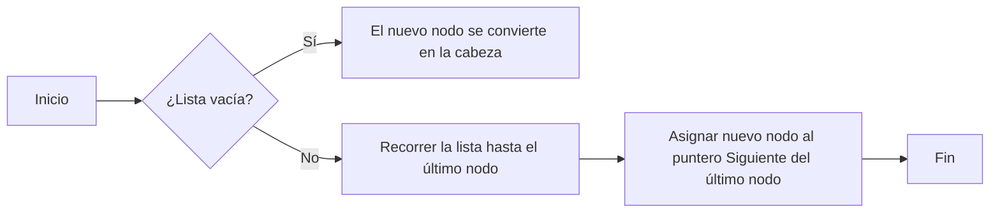

# Ejemplo de utilizar **MERMAID** para mi proyecto de demostracion de competencias

## Diagrama

```mermaid
graph LR
    A[Inicio] --> B{¿Lista vacía?}
    B -- Sí --> C[El nuevo nodo se convierte en la cabeza]
    B -- No --> D[Recorrer la lista hasta el último nodo]
    D --> E[Asignar nuevo nodo al puntero Siguiente del último nodo]
    E --> F[Fin]
```

## Ejemplo

```mermaid
flowchart LR
    H["HEAD"]:::head --> A["A"]:::nodo
    A --> B["B"]:::nodo
    B --> C["C"]:::nodo
    C --> D["D"]:::nodo
    D --> N["null"]:::null

    classDef head fill:#2196F3,stroke:#0D47A1,color:#fff,stroke-width:2px;
    classDef nodo fill:#4CAF50,stroke:#2E7D32,color:#fff,stroke-width:2px;
    classDef null fill:#F44336,stroke:#B71C1C,color:#fff,stroke-width:2px;

```