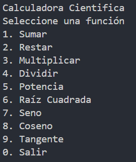

# Calculadora Científica
## Microevaluación 1

**Universitario:** Edwin Quisbert Montalvo

### Configuración de ambiente

* [Visual Studio Code](https://code.visualstudio.com/)
* [Control de versiones con Git](https://git-scm.com/)
* [Dotnet](https://dotnet.microsoft.com/en-us/download)

---

### 1. Configurar una clave SSH en el entorno local

1. **Verificar claves existentes**
    ```bash
    ls -al ~/.ssh
    ```
2. **Generar una nueva clave SSH**
    ```bash
    ssh-keygen -t ed25519 -C "tu_correo@ejemplo.com"
    ```
    Presiona Enter para aceptar la ubicación por defecto y asigna una contraseña si lo deseas.

3. **Agregar la clave SSH al agente**
    ```bash
    eval "$(ssh-agent -s)"
    ssh-add ~/.ssh/id_ed25519
    ```

4. **Copiar la clave pública**
    ```bash
    cat ~/.ssh/id_ed25519.pub
    ```
    Copia el contenido y agrégalo en [GitHub > Settings > SSH and GPG keys](https://github.com/settings/keys).

---

### 2. Subir una rama a GitHub

1. **Crear y cambiar a una nueva rama**
    ```bash
    git checkout -b nombre-de-tu-rama
    ```
2. **Agregar y commitear los cambios**
    ```bash
    git add .
    git commit -m "Descripción de los cambios"
    ```
3. **Subir la rama al repositorio remoto**
    ```bash
    git push -u origin nombre-de-tu-rama
    ```

---

### 3. Clonar y ejecutar el proyecto en otro equipo

1. **Clonar el repositorio**
    ```bash
    git clone https://github.com/pum3ucatec/estructura-datos.git
    cd estrutura-datos
    ```
2. **Cambiar a la rama correspondiente**
    ```bash
    git checkout EdwinQuisbert/microevaluacion1
    ```
3. **Restaurar dependencias y ejecutar el programa en C#**
    ```bash
    dotnet restore
    dotnet run
    ```
#### Calculadora Científica

La calculadora puede realizar las siguientes funciones:



con datos que se le envie a través de la consola

---

> **Nota:** Asegúrate de tener configurado .NET y Git en tu equipo antes de ejecutar los comandos.
