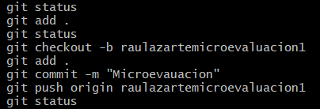

### ESTRUCTURA DE DATOS I
___

**Docente**: Lic. Gaston Quelali

**Estudiante**: *Raul Lazarte*
___

## CONFIGURACION DE AMBIENTE

- [Visual Studio Code](https://code.visualstudio.com/)
- [Control de versiones Git](https://git-scm.com/)
- [DotNet](https://dotnet.microsoft.com/en-us/download)
___
## PARA CREAR REPOSITORIO
- Crear un repositorio local
```
mkdir nombre-repositorio
cd nombre-repositorio
```
- Verificar
```
git status
```
nos indica si estamos en la rama principal (mater)

- Inicializar el repositorio
```
git init
```
- Conectar el repositorio local con GitHub
```
git remote add origin https://github.com/TU_USUARIO/mi_proyecto.git
```
- Añadimos archivo y realizar Commit
```
git add README.md
git commit -m "Mi primer commit"
```
- Subir los cambios a GitHub
```
git branch -M main
git push -u origin main
```
___

## CREAR UNA RAMA EN GIT
> VERIFICAR EN QUE RAMA NOS ENCONTRAMOS

```
git branch

```
> CREAR UNA NUEVA RAMA Y MOVERTE A LA RAMA
```
git -b nombre-de-la-rama
```
> VERIFICAR SI ESTAMOS EN LA RAMA
```
git branch
```
___
## CREAR UN COMMIT
1. Estado del repositorio
```
git status
```
2. Agregar capertas y/o archivos
```
git add .
```
3. Crear el commit
```
git commit -m "MI PRIMER COMMIT"
```
4. Subir el commit al repositorio remoto
```
git push
```
## RESULTADO
```
history
```

